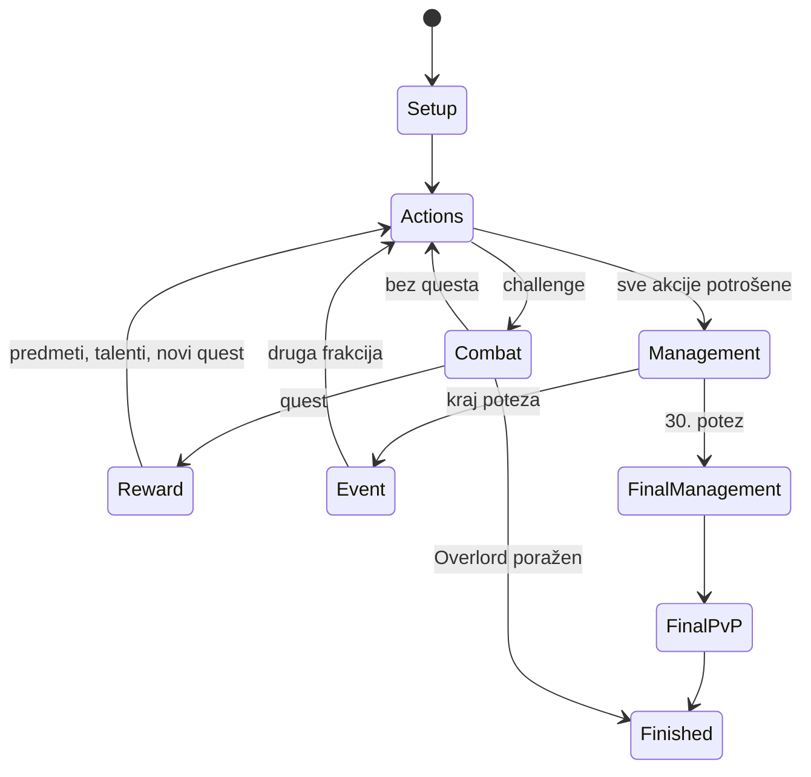

# Engine v2

`src/rules/game.ts` izlaže `createGame(pack, setup)` i `apply(pack, state, command)`. Reducer klonira stanje, provjerava i izvršava naredbu. Neispravna naredba ne ostavlja djelimične promjene. React, server i AI koriste isti reducer.

## Tok



Ratni zadaci mogu prekinuti upravljanje zbog nagrada. Talent i posljednja prilika za liječenje su obavezne odluke prije nastavka. Više questova završenih jednim izazovom obrađuje se redom, svaki sa zamjenom.

## Moduli

| Modul | Odgovornost |
| --- | --- |
| `model.ts` | Podaci, skripte, stanje i naredbe |
| `movement.ts` | Graf, letovi, blokade, putanje i groblja |
| `inventory.ts` | Spellbook, torba, slotovi, dodaci, ljubimci i gradske transakcije |
| `effects.ts` | Tipizirani efekti, uslovi, vrijeme, energija i ponovna upotreba |
| `combat.ts` | Napadači, kockice, minioni, pogoci, rane, poraz i PvP |
| `rewards.ts` | XP, nivoi, nagrade, zalihe figura i quest špilovi |
| `events.ts` | Bonus lanci, aukcije, ratovi, trgovac i Fate ruta |
| `legal.ts` | Kandidati provjereni kroz reducer |
| `view.ts` | Javno stanje bez RNG-a, špilova i tuđih tajnih ponuda |
| `session.ts` | Verzija, fingerprint, setup, naredbe i replay |

Enumeracija legalnih poteza je praktičan skup kandidata, ne svaka kombinacija. Editor može predložiti složeniju kombinaciju: više gradskih transakcija, cijelu opremu ili trgovinu. Reducer/server uvijek provjerava stvarnu naredbu. AI trenutno uglavnom bira enumerirane kandidate.

## Skripte

Skripte su podaci, ne JavaScript stringovi. Čvorovi: `dice`, `resource`, `stat`, `token`, `change`, `spot`, `remove`, `if`, `condition`, `discard-self`, `heal-pet`. Nema `eval` izvršavanja.

```ts
{
  id: 'reroll',
  timing: 'reroll',
  effects: [{ op: 'stat', stat: 'reroll', amount: 2 }]
}
```

Sposobnost ima ID, vrijeme aktivacije, opcionalni trošak i zavisnost od primarne sposobnosti. Može birati kockice ili prijateljskog učesnika. Karte, talenti i rasne moći dijele izvršavanje, ali originalne rasne moći nisu unesene.

Aktivni interpreter pokriva borbene efekte. `action` i `equip` su rezervisani tipovi; slobodne neborbene sposobnosti i složeni prekidi toka još zahtijevaju implementaciju uz originalne tekstove. Promjene kapaciteta, oživljavanje, sve klasne interakcije i tri originalna Overlord profila nisu završeni samim postojanjem općeg AST-a.

## AI

`src/ai/planner.ts`: `decide(pack, publicView, legalMoves, difficulty)`. Procjenjuje oporavak, udaljenost, okupljanje, očekivane pogotke i rizik, opremu, trening, rane i nagrade. Vraća naredbu, ocjenu i objašnjenje.

Ne koristi LLM, vanjski API ni skriveni seed. U mreži server odlučuje za botove, klijent samo traži sljedeći potez. Heuristika nema duboko pretraživanje niti garanciju optimalne igre. Mrežni stil je uravnotežen; lokalno postoje oprezan, uravnotežen i agresivan stil.

## Replay

Seed određuje špilove, d8 i izjednačenja. Lokalni zapis čuva setup i naredbe, a stanje se izvodi reducerom. Fingerprint sprečava otvaranje zapisa sa izmijenjenim kartama. Pri promjeni pravila koja mijenja replay treba podići verziju paketa.

PRNG je deterministički za razvoj/replay, nije kriptografski generator za takmičarske turnire. Server bira mrežni seed i ne šalje ga klijentima. Izvoz tajnog mrežnog replaya tokom aktivne partije nije omogućen.
