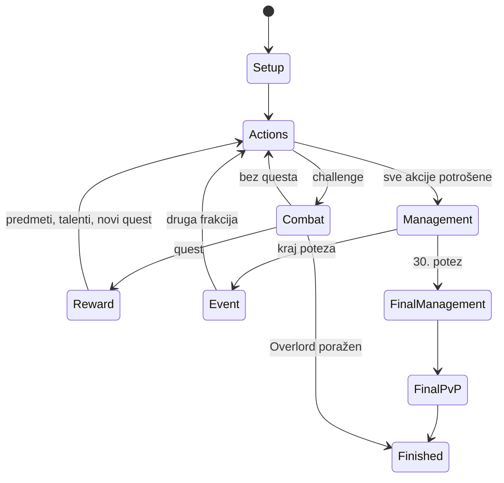

# Engine v0.6 · osnovni set

`src/rules/game.ts` izlaže `createGame(pack, setup)` i `apply(pack, state, command)`. Reducer klonira stanje, provjerava i izvršava naredbu. Neispravna naredba ne ostavlja djelimične promjene. React i AI koriste `BASE_PACK` iz `src/data/base/`. Server dijeli reducer, ali je online razvoj na holdu i njegov fixture paket još nije migriran na osnovni set.

## Tok



Ratni zadaci mogu prekinuti upravljanje zbog nagrada. Talent i posljednja prilika za liječenje su obavezne odluke prije nastavka. Više questova završenih jednim izazovom obrađuje se redom, svaki sa zamjenom.

## Moduli

| Modul | Odgovornost |
| --- | --- |
| `model.ts` | Podaci, skripte, stanje i naredbe |
| `movement.ts` | Graf, letovi, blokade, putanje i groblja |
| `inventory.ts` | Spellbook, torba, slotovi, dodaci, ljubimci i gradske transakcije |
| `effects.ts` | Tipizirani efekti, uslovi, vrijeme, energija i ponovna upotreba |
| `combat.ts` | Napadači, kockice, minioni, pogoci, rane, poraz i PvP |
| `rewards.ts` | XP, nivoi, nagrade, zalihe figura i quest špilovi |
| `events.ts` | Bonus lanci, aukcije, ratovi, trgovac, kuga i Fate ruta |
| `event-choices.ts`, `event-rewards.ts`, `legal-events.ts` | Višestruke odluke, retrening, profesije, nagrade i legalni kandidati događaja |
| `world.ts` | Trajni svjetski efekti, Kazzakovi identiteti, trofeji, boss događaji, Nefarianov Bulwark |
| `legal.ts` | Kandidati provjereni kroz reducer |
| `view.ts` | Javno stanje bez RNG-a, špilova i tuđih tajnih ponuda |
| `session.ts` | Verzija, fingerprint, setup, naredbe i replay |

Enumeracija legalnih poteza je praktičan skup kandidata, ne svaka kombinacija. Editor može predložiti složeniju kombinaciju: više gradskih transakcija, cijelu opremu ili trgovinu. Reducer/server uvijek provjerava stvarnu naredbu. AI trenutno uglavnom bira enumerirane kandidate.

## Skripte

Skripte su tipizirani podaci, bez `eval` izvršavanja. AST u `model.ts` opisuje kockice, resurse, statistike, tokene, promjene, Spot, uklanjanje, uslove, statuse, liječenje ljubimaca, grupne efekte i posebne radnje. Interpreter provjerava vrijeme, uslove, ciljeve, trošak i ponovnu upotrebu. Statička polja karata opisuju kapacitete, ograničenja opreme, cijene, dodatna mjesta i popuste.

```ts
{
  id: 'reroll',
  timing: 'reroll',
  effects: [{ op: 'stat', stat: 'reroll', amount: 2 }]
}
```

Sposobnost ima ID, vrijeme aktivacije, opcionalni trošak i zavisnost od primarne sposobnosti. Može birati kockice, njihove boje, prijateljskog učesnika, kapacitet resursa ili mjesto opreme. Sve klasne karte, predmeti i rasne moći osnovnog seta sada su uneseni. `source.ts` bilježi originalni sken i eventualnu FAQ korekciju.

Interpreter pokriva borbene prozore, početak/kraj runde, početak poteza, potrošnju energije, odmor, trening, opremanje i akcijske moći. Portal mora biti odmah sljedeća akcija nakon pripreme i može prebaciti samo saveznike; Summon, Intercept, Resurrection i Reincarnation imaju zasebne uslove toka. `lastActions` čuva učesnike posljednje grupne akcije za čišćenje kuge.

Oba profila tri Overlorda koriste originalne statistike. Kazzak skriva pravi identitet među pet tokena po frakciji. Nefarian pomjera Fate i pokreće prisilnu uzastopnu borbu u Bulwarku. Kel’Thuzad uključuje dodatne događaje i izmjene borbe. Prisustvo skripte nije dokaz svake kombinacije: preostale provjere su u [RULES-COVERAGE.md](RULES-COVERAGE.md), a izvršeni testovi u [VALIDATION.md](VALIDATION.md).

## AI

`src/ai/planner.ts`: `decide(pack, publicView, legalMoves, difficulty)`. Procjenjuje oporavak, udaljenost, okupljanje, očekivane pogotke i rizik, opremu, trening, rane i nagrade. Vraća naredbu, ocjenu i objašnjenje.

`src/ai/loadout.ts` pretražuje cijelu kombinaciju mjesta kroz beam od najviše 36 kandidata po koraku i vraća šest najboljih legalnih prijedloga. Stvarni `manage` provjerava energiju, kapacitete, kategorije, dodatke i torbu. Trening može obuhvatiti do tri moći u jednom bot prijedlogu; ljudski editor podržava sve dostupne moći u jednoj akciji. Kretanje se nagrađuje samo kada skraćuje put prema cilju.

`Setup.variants` uključuje opcione varijante iz pravilnika. `State.lap` prati ponavljanje turn tracka u Defeat the Overlord režimu. Town komanda koristi opcioni `recoverAfter` indeks za oporavak između transakcija (`-1` preskače oporavak); izostavljen indeks zadržava raniji redoslijed. Management komanda može navesti `reEquip` za izričito ponovno opremanje već aktivne moći.

Novi planer ciljeva i borbe opisan je u [AI-ENGINE.md](AI-ENGINE.md), zajedno s izvorima i granicama procjena. Koristi planove putovanja i sastava ekipe, procjene borbe kroz više rundi, stvarne efekte sposobnosti i ograničeno pretraživanje dvije povezane sposobnosti. Class deck je katalog za trening; samo opremljene i pravilima dostupne sposobnosti ulaze u borbene odluke.

Ne koristi LLM, vanjski API ni skriveni seed. U browseru planiranje radi u Web Workeru, a server koristi istu politiku. Bounded search nema garanciju matematički optimalne igre. Mrežni stil je uravnotežen; lokalno postoje oprezan, uravnotežen i agresivan stil.

## Replay

Seed određuje špilove, d8 i izjednačenja. Lokalni zapis čuva setup i naredbe, a stanje se izvodi reducerom. Fingerprint sprečava otvaranje zapisa sa izmijenjenim kartama. Pri promjeni pravila koja mijenja replay treba podići verziju paketa.

PRNG je deterministički za razvoj/replay, nije kriptografski generator za takmičarske turnire. Server bira mrežni seed i ne šalje ga klijentima. Izvoz tajnog mrežnog replaya tokom aktivne partije nije omogućen.
